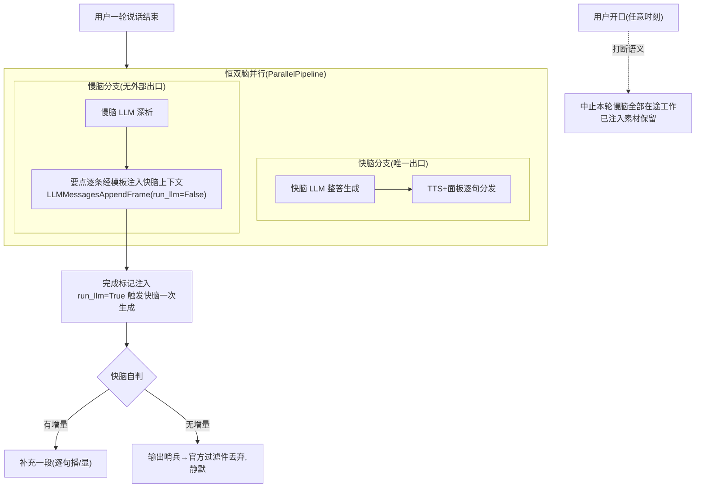

# 快慢脑(dual-brain)PRD / Proposal

> 状态: **已批准**(用户终审"过",2026-08-02)  更新: 2026-08-02  级别: **L3**(定级依据: 预估 diff >500 行;业务规则 9 条临界;波及 server 管线/evals/client 面板;慢脑云 LLM 依赖)
> 调研留痕与 22 条拍板记录: 同目录 `research.md`;评审材料四图: artifact「快慢脑最新方案」(源清单见 research.md)。

## Why

单脑管线(1 期基线 voice-assistant-p1)答深问题只能浅答。给对话加"慢脑":快脑保持即时流畅应答,慢脑后台深析、结果作为语义素材回流给快脑消化,面向面试辅助、架构研究、逻辑讨论场景。2 期两个独立变更之一(另一个 task-dispatch 挂起),本期只做**确定的核心流程**。

## What Changes

- 新增恒双脑并行管线:每轮用户输入同时送快脑(唯一发言者)与慢脑(数据生产者,无外部输出);
- 慢脑深析要点经注入模板实时写入快脑上下文;完成标记落地后触发快脑一次生成,快脑自判补充或静默(哨兵+官方过滤件);
- 用户开口即中止慢脑相关在途工作(框架打断语义);慢脑失败走官方 `ErrorFrame`/`on_pipeline_error` 统一异常路,静默降级+面板提示;
- **STT/TTS 替换(测试前置)**:本地 Whisper STT 与 Kokoro TTS **停用移除**(太慢),换旧项目在用的两个付费 API,音色中文;不保留本地回退(费用无忧,用户拍板);
- 快脑上下文构成预留"历史摘要段"口子(官方 `LLMContextSummarizer` 后续直挂,本期不启用)。
- 实现总原则(用户拍板):**只用 pipecat 官方原语与组件;官方达不到理想要求不造零件补,接受官方原样行为("差不多就行")**。全案非官方物仅两样:注入模板 prompt、一行哨兵过滤谓词。

## Capabilities

- **New Capabilities**: `dual-brain`(本文件 §规则 R1–R9 为其需求增量的内容基础)
- **Modified Capabilities**: 无——voice-assistant-p1 的 7 条需求不变(STT/TTS 替换属实现层,不改需求语义;R9 显式承接其回归保持)

## Impact

- `server/bot.py`(管线改双分支)、`server/prompts.py`(注入模板/快脑发言规则)、`server/config.py`(慢脑 LLM + 付费 STT/TTS 配置项,快速失败沿用)、`server/evals/`(新增场景)、client 面板(仅消费现有文本通道,预计零改或极小改);
- 新依赖:慢脑云 LLM API、付费 STT/TTS API(具体选型门二从旧库 `docs/legacy-capability-index.md` 定点取材);
- 无新增外部契约字段(单用户本机,LAN-only;暴露公网前必补鉴权的账单约束不变)。

---

## PRD 详节

### 1. 角色 × 操作矩阵

| 角色 | 能做 | 不能做 |
|---|---|---|
| 用户(单用户本人) | 说话、打断、看面板 | — |
| 快脑 | 唯一发言者:应答、消化素材、自判补充 | 不得转播慢脑原文 |
| 慢脑 | 深析、按模板产素材 | 不对接 TTS/面板等任何外部输出 |
| 面板 | 逐句显示快脑输出、显示系统状态提示(如慢脑失败) | 不显示慢脑原始产物 |

### 2. 业务流程(L3 流程图)

### 3. 状态机

免状态机声明:对话≠任务(拍板 13),无任务对象、无状态管理、无调度器。"深析在途/已完成/已中止/已失败"仅作验收表述词汇。

### 4. 业务规则与验收(EARS;观测=eval 原语 + 结构化日志行 grep;时序类场景接受固定延迟偶发不准——"差不多"口径)

- **R1 恒双发**:当用户一轮说话结束时,系统必须(SHALL)将该轮输入同时送达快脑与慢脑。
  - R1-S1:GIVEN 会话中 WHEN 用户说完深问题 THEN 快脑开始回应,且日志出现该轮"慢脑派发"行。
- **R2 快脑唯一发言**:系统必须(SHALL)仅经快脑产生**对话内容**的语音与面板输出;系统状态提示除外。
  - R2-S1:深问题全程,输出中不出现注入模板痕迹(judge 负向判据)。
- **R3 素材注入**:当慢脑产出深析要点时,系统必须(SHALL)逐条按注入模板写入快脑上下文(模板标明其为背景素材与完成度标记(字面串以 design §6.1 为准 —— 该串同时是 R2-S1 泄漏 judge 的负向锚,两处必须一致)),且不触发即时播报;若慢脑自判无可深析,则**零输出**、不注入(不约定任何占位 token,理由见 design §6.7①)。**注入前须校验该要点所基于的用户问题仍是当前问题,不一致则丢弃不注入**(保证素材在上下文中的位置忠实反映其归属,见 R7)。
  - R3-S1:深问题→日志出现"注入"行且注入时无同步播报;R3-S2:闲聊轮→无注入行。
- **R4 补充自判**:当完成标记注入落地时,系统必须(SHALL)以 `run_llm=True` 触发快脑一次生成(若 bot 正在播报,行为按框架排队语义原样);快脑自判输出补充或输出哨兵(被过滤,不播)。
  - R4-S1:深问题→简答后窗口内出现衔接的第二段(judge 失败特征式判据);R4-S2:简单问题→`absent:true` 无第二段。
- **R5 打断中止**:在慢脑深析或其补充生成在途期间,当用户开口时,系统必须(SHALL)中止该轮慢脑相关全部在途工作;已注入素材保留在上下文。(会话断连由 1 期 `on_client_disconnected` 整体 cancel 现状覆盖,bot.py:152 实证)
  - R5-S1:深析窗口内插话→该轮无补充,日志出现"中止"行。
- **R6 逐句分发**:系统必须(SHALL)将快脑对话输出逐句送 TTS 与面板;哨兵输出不送。
  - R6-S1:音频模式,`tts_response` 事件次数=句数(自动);面板侧人工抽查(已知限制:无独立按句事件)。
- **R7 单深析在途**:当新一轮输入送达时,系统必须(SHALL)使旧深析随打断语义终止,新深析随双发启动;**旧轮在途要点因注入前校验失败而丢弃,不进入上下文**——已注入的素材保留原位,其在对话流中的位置(位于旧问题之后、新问题之前)即其归属依据,不额外编号、不依赖提示词让快脑忽略。
  - R7-S1:连续两个深问题→补充语义只对应第二问,第一轮日志出现"中止"行。

  > **修订(2026-08-02,用户直接拍板,未回门一)**:原文为"旧轮残余素材由模板轮次标识供快脑忽略"。改动理由:①原方案需要轮次计数器 + `问题#N` 模板字段 + 快脑提示词规则"只消化编号最大的一组"三件套,且**依赖模型服从性**——快脑不听话即失效;②素材是按时间顺序穿插进对话流的(user/assistant 消息之间),**位置本身即归属证据**,LLM 依常规上下文理解即可分辨,无需显式编号;③快脑每次触发均以完整上下文重新生成,旧素材在其答完旧问题时已被消化,到新问题时已退化为历史记录。改后自研物减少一个(轮次计数器撤销),并消除一条模型服从性依赖。参照:Talker-Reasoner 的 `belief_is_stale_for_this_turn` 朴素比对(复现代码 `memory.py` 实证),判定点因架构差异由"拉取时"前移至"注入前"。
- **R8 慢脑失败静默降级**:如果慢脑调用失败或自身超时(API 超时配置项),则系统必须(SHALL)经官方 `ErrorFrame`/`on_pipeline_error` 路静默放弃该轮深析、仅面板提示,对话不受影响;被 R5/R7 中止不计失败。故障注入=env 配置指向无效端点,零新代码。
  - R8-S1:配置注入故障→快脑正常应答、无补充、日志"失败"行+面板提示;R8-S2:故障轮后下一轮正常问答。
- **R9 回归保持**:系统必须继续(SHALL CONTINUE TO)保持 1 期既有自动化基线全绿(eval 场景 + pytest + 冻结检查脚本)。(1 期 R2/R3/R7 本无自动化覆盖,记已知限制,本期不回填)
  - R9-S1:三类既有基线全绿(以本次运行时间戳为证)。

### 5. 异常与边界

慢脑空产出→不注入不触发(R3);慢脑分支异常经官方 ErrorFrame 路,不拖垮快脑(波及行为按框架原样,门二 PoC 观察);慢脑/付费 API 配置缺失→沿用 1 期启动快速失败(P1-R5 扩展);补充播报中被插话→1 期打断基线覆盖;慢脑上下文不含快脑答案,去重责任在快脑(模板护栏);素材注入相对助手消息的落位细节=门二 PoC 顺带确认。

### 6. 不做什么(YAGNI 排除清单,均可后续独立立项)

分段生成续接/句间融入(后期优化首选);安全插入窗调度器;状态机/任务对象;语义路由/场景开关;答案质量指标(不矛盾仅模板软护栏);资料检索;长会话压缩(仅留摘要段口子);鉴权/权限/审计/限制;多深析并行;预生成/前置脑/思考音/垫话;新 UI 组件;本地 STT/TTS 回退。
**已知限制(backlog)**:长会话素材累积无淘汰;面板慢脑状态生命周期只提示失败;R1 穷尽性无自动化证明;P1 R2/R3/R7 测试缺口不回填;时序类 eval 场景固定延迟偶发不准。not_managed 表:不适用(非纳管类)。

### 7. 待确认项(交接旗→门二)

1. **PoC 清单**(照官方测试/示例拼装后观察原样行为,不造修正层):①Producer/Consumer 跨分支搬运的帧如何落成快脑上下文消息;②`run_llm=True` 在播报中触发的排队语义;③打断/ErrorFrame 跨 ParallelPipeline 分支的传播与隔离;④哨兵过滤谓词。
2. 注入模板字段与措辞定稿(参考:用户口述版 + LTS JSON 快照字段 + qwen 语义素材契约)。
3. 慢脑 LLM 选型与配置(云 API,费用无忧;账单口径慢脑 70B 级)。
4. **付费 STT/TTS 选型与配置**:旧库定点取材(`docs/legacy-capability-index.md`),中文音色;本地 Whisper/Kokoro 停用移除。
5. 双分支上下文结构与素材落位(官方双聚合器示例为底)。
6. NFR 数值目标本期不设(质量不要求;旧标准首响≤1s/衔接≤2s 仅留参考);辅助项勾选用户未答→核心版。
